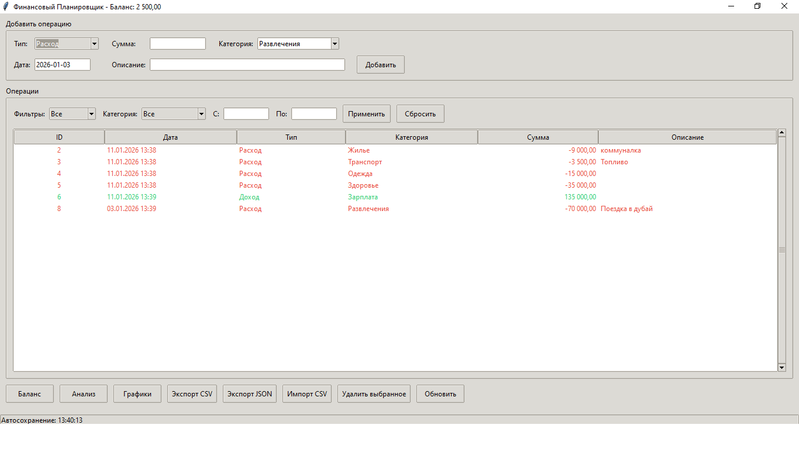
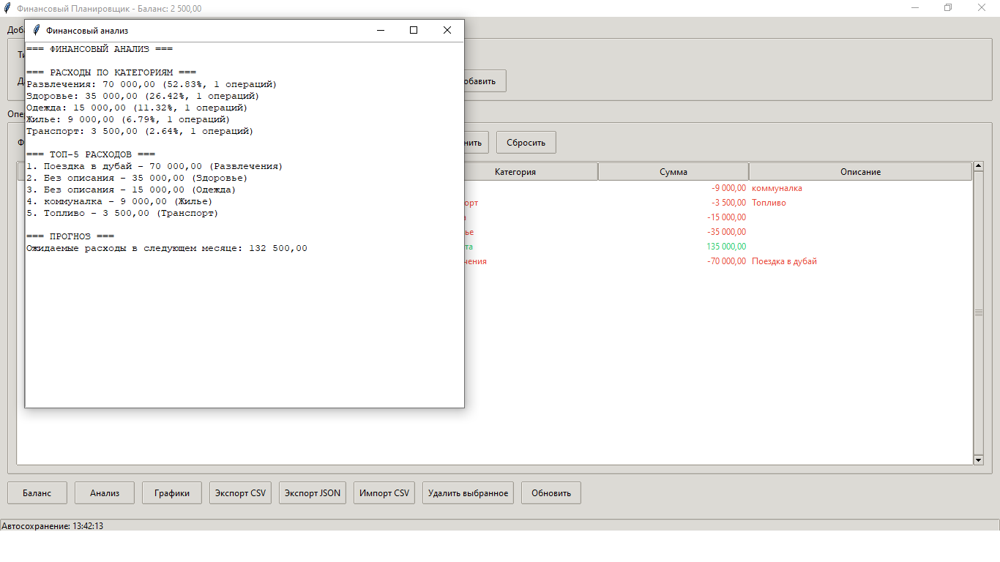
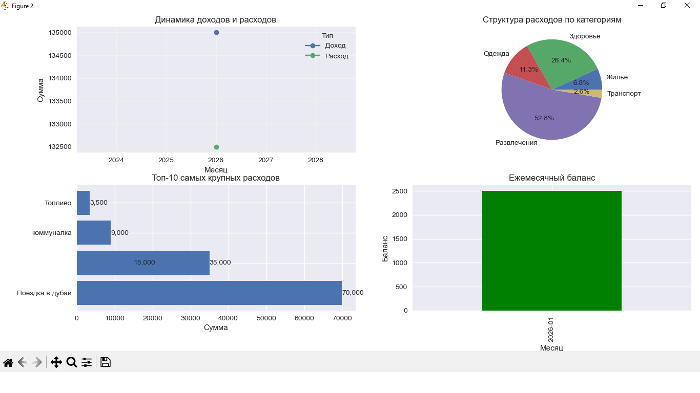

  Финансовый Планировщик

Приложение для учета личных финансов с анализом и визуализацией данных.

  📋 Функциональность

  Основные возможности:
- ✅ Добавление доходов и расходов
- ✅ Категоризация операций
- ✅ Просмотр истории операций с фильтрацией
- ✅ Расчет текущего баланса
- ✅ Анализ финансовых данных
- ✅ Визуализация в виде графиков
- ✅ Импорт/экспорт данных (CSV, JSON)
- ✅ Устойчивость к ошибкам
- ✅ Unit-тесты

Аналитика:
- 📊 Динамика доходов и расходов
- 📈 Распределение по категориям
- 📉 Топ-10 самых крупных расходов
- 📅 Помесячные тренды
- 🔮 Прогнозирование расходов


🖼️Скриншоты:






🚀 Установка и запуск
```bash
git clone https://github.com/Popkapov/finance-planner.git
cd finance-planner
```
Установка зависимостей
```bash
pip install -r requirements.txt
```
Запуск приложения
```bash
python main.py
```
📁 Структура проекта
```text
finance_planner/
├── main.py              # Главный файл
├── models.py            # Классы данных
├── database.py          # Работа с БД
├── analysis.py          # Анализ данных
├── visualization.py     # Графики
├── gui.py               # Интерфейс
├── storage.py           # Импорт/экспорт
├── utils.py             # Вспомогательные функции
├── tests.py             # Unit-тесты
├── requirements.txt     # Зависимости
└── README.md            # Документация
```
🧪 Тестирование
```bash
python -m unittest tests.py
